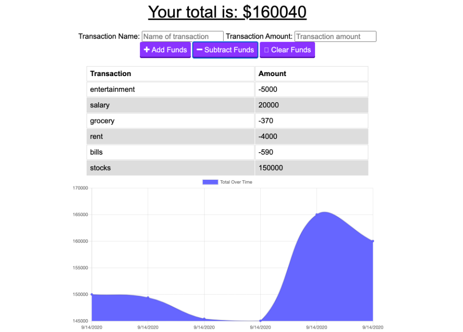

# PWA-Online-Offline-Budget-Trackers

GIVEN a user is on Budget Tracker Application (PWA) without an internet connection (IndexedDB, Service Worker) WHEN the user inputs a withdrawal or deposit THEN that will be shown on the page, and added to their transaction history (MongoDB Atlas) when their connection is back online.

[Heroku deployed App](https://floating-castle-47147.herokuapp.com/)

The user will be able to add expenses and deposits to their budget with or without a connection using indexedDB. When entering transactions offline, they should populate the total when brought back online and all data are transferred to Mongo DB Atlas.

Offline Functionality:

  * Enter deposits offline

  * Enter expenses offline

When brought back online:

  * Offline entries should be added to tracker.

## User Story
AS AN avid traveller
I WANT to be able to track my withdrawals and deposits with or without a data/internet connection
SO THAT my account balance is accurate when I am traveling

## Business Context

Giving users a fast and easy way to track their money is important, but allowing them to access that information anytime is even more important. Having offline functionality is paramount to our applications success.

